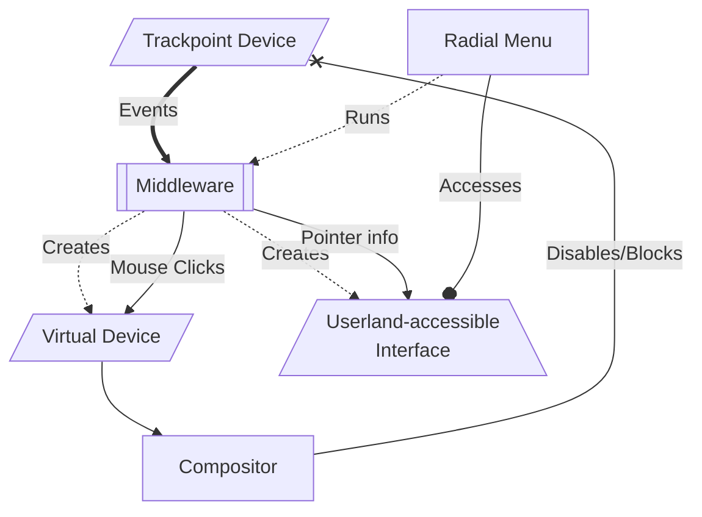
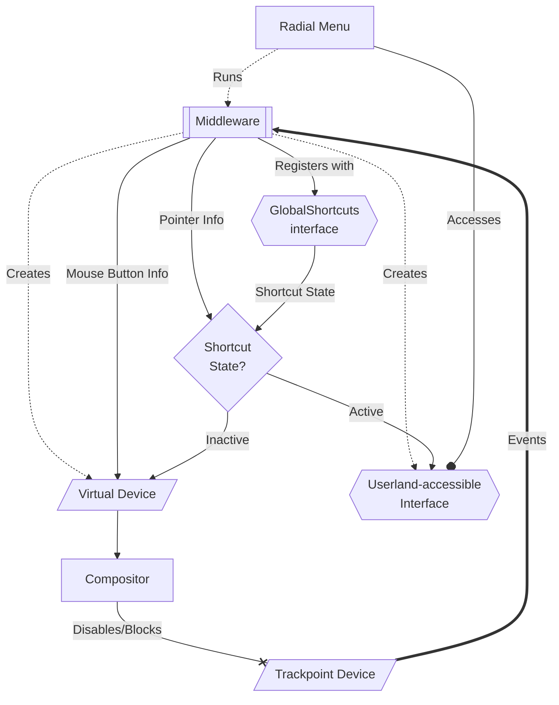

## Trackpoint Radial Menu
This is a project to give a Thinkpad Trackpoint an alternative use: control of a radial menu for system control. 

**Inspirations**
- [https://github.com/kando-menu/kando](https://github.com/kando-menu/kando)
    - I'd love to use this, but it's currently not ideal on Hyprland due to it acting like a normal window, which is quite finicky. Perhaps it's due to Electron, but it behaves like a typical window instead of taking advantage of [wl-roots layers](https://wayland.app/protocols/wlr-layer-shell-unstable-v1) (at least for now). In the future, I would like to split off the middleware into its own application that can be used with Kando; for now, though, I'll be targeting a custom Gtk app for myself.
- Radial menus in games like Doom Eternal, BeamNG.drive, etc.
    

### WIP Feature List
- Snap select
    - In this mode, radial menu selections occur when the Trackpoint snaps back to neutral. 
### WIP Implementation
For now, the flow of data will look something like this. The compositor must first disable or ignore the Trackpoint input; however, this also disables the associated buttons, which may be undesired. Fortunately, the middleware accounts for that: it must run with proper permissions to intercept the input events and forward the mouse buttons to a virtual device created with the `uinput` kernel module, or to a user-accessible interface. From there, the radial menu takes 

Some users may want to allow the Trackpoint to behave as a pointer in contexts, e.g. if you're dexterous enough to use it as an actual mouse, and the radial menu should only appear if certain condition is met, e.g. the Super key being held. In that context, the flow of data will look something like this (using Freedesktop's GlobalShortcuts portal to handle the shortcut state):

